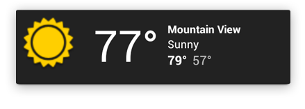

# APP WIDGETS

[**Overview**](#Overview)

[**Build an App Widget**](#Widget types)

<hr/>

## Overview

Widgets are an essential aspect of home screen customization. You can imagine them as "at-a-glance" views of an app's most important data and functionality that is accessible right from the user's home screen. Users can move widgets across their home screen panels, and, if supported, resize them to tailor the amount of information within a widget to their preference.

### Widget types

Widgets typically fall into one of the following categories:

#### Information widgets


Information widgets typically display a few crucial information elements that are important to a user and track how that information changes over time.

Good examples for information widgets are weather widgets, clock widgets or sports score trackers. 

Touching information widgets typically launches the associated app and opens a detail view of the widget information.

#### Collection widgets


As the name implies, collection widgets specialize in displaying multitude elements of the same type, such as a collection of pictures from a gallery app, a collection of articles from a news app or a collection of emails/messages from a communication app. 

Collection widgets typically focus on two use cases: 
- Browsing the collection.
- Opening an element of the collection to its detail view for consumption. 

Collection widgets can scroll vertically.

#### Control widgets


The main purpose of a control widget is to display often used functions that the user can trigger right from the home screen without having to open the app first. Think of them as remote controls for an app. 

A typical example of control widgets are music app widgets that allow the user to play, pause or skip music tracks from outside the actual music app.

Interacting with control widgets may or may not progress to an associated detail view depending on if the control widget's function generated a data set, such as in the case of a search widget.

#### Hybrid widgets


While all widgets tend to gravitate towards one of the three types described above, many widgets in reality are hybrids that combine elements of different types.

For example, a music player widget is primarily a control widget, but also keeps the user informed about what track is currently playing. It essentially combines a control widget with elements of an information widget type.

### Widget limitations

Because widgets live on the home screen, they have to co-exist with the navigation that is established there. So, the only gestures available for widgets are:

- Touch
- Vertical swipe


## Build an App Widget

To create an App Widget, we need the following:

- **AppWidgetProviderInfo object:**<br/>
Describes the metadata for an App Widget, such as the App Widget's layout, update frequency, and the AppWidgetProvider class. This should be defined in XML.

- **AppWidgetProvider class implementation:**<br/>
Defines the basic methods that allow you to programmatically interface with the App Widget, based on broadcast events. Through it, you will receive broadcasts when the App Widget is updated, enabled, disabled and deleted.

- **View layout:**<br/>
Defines the initial layout for the App Widget, defined in XML.

- **App Widget configuration Activity:**<br/>
This is an optional Activity that launches when the user adds your App Widget and allows them to modify App Widget settings at create-time.

### Declaring an App Widget in the Manifest

```xml
<receiver
    android:name="com.ramijemli.appid.widget.ShortcutsWidget"
    android:label="AppName">
    <intent-filter>
        <action android:name="android.appwidget.action.APPWIDGET_UPDATE" />
        <action android:name="${applicationId}.widget.CUSTOM_ACTION" />
    </intent-filter>
    <meta-data
        android:name="android.appwidget.provider"
        android:resource="@xml/widget_config" />
</receiver>
```

### Adding the AppWidgetProviderInfo Metadata

```xml
<appwidget-provider xmlns:android="http://schemas.android.com/apk/res/android"
    android:minWidth="40dp"
    android:minHeight="40dp"
    android:updatePeriodMillis="86400000"
    android:previewImage="@drawable/preview"
    android:initialLayout="@layout/example_appwidget"
    android:configure="com.example.android.ExampleAppWidgetConfigure"
    android:resizeMode="horizontal|vertical"
    android:widgetCategory="home_screen">
</appwidget-provider>
```
- **minWidth and minHeight:** The default widget size.

- **minResizeWidth and minResizeHeight:** The App Widget's absolute minimum size when resizing is enabled.

- **updatePeriodMillis:** This defines how often the onUpdate() callback method from the AppWidgetProvider class is called. This defaults to 3600000. For more, AlarmManager is needed.

- **initialLayout:** The widget's layout.

### Creating the App Widget's layout

The layout should use only the views that are accepted by the RemoteViews class.

A RemoteViews object (and, consequently, an App Widget) can support the following layout classes:

- FrameLayout
- LinearLayout
- RelativeLayout
- GridLayout

And the following widget classes:

- AnalogClock
- Button
- Chronometer
- ImageButton
- ImageView
- ProgressBar
- TextView
- ViewFlipper
- ListView
- GridView
- StackView
- AdapterViewFlipper
- Descendants of these classes are not supported.

RemoteViews also supports ViewStub, which is an invisible, zero-sized View you can use to lazily inflate layout resources at runtime.

#### Adding margins to App Widgets

To add margins, we can use the padding attribute.

```xml
<FrameLayout
    android:layout_width="match_parent"
    android:layout_height="match_parent"
    android:padding="@dimen/widget_margin">
...
```

```kotlin
class ShortcutsWidget : AppWidgetProvider() {

    override fun onEnabled(context: Context?) {
        super.onEnabled(context)
        context ?: return

        // Update widget
        val appWidgetManager = AppWidgetManager.getInstance(context)
        val widgetComponent = ComponentName(context, javaClass)
        appWidgetManager.updateAppWidget(widgetComponent, remoteViews)

    }

    override fun onUpdate(
        context: Context?,
        appWidgetManager: AppWidgetManager?,
        appWidgetIds: IntArray?
    ) {
        context ?: return
        appWidgetManager ?: return

        // Update each widget
        appWidgetIds?.forEach { widgetId ->
            // Create RemoteViews according to the provided size
            val widgetOptions = appWidgetManager.getAppWidgetOptions(widgetId)
            val remoteViews = createRemoteViews(context, widgetOptions)

            // Set up the widgets' layout
            setUpWidgetsLayout(context, remoteViews, null)

            // Update widgets
            appWidgetManager.updateAppWidget(widgetId, remoteViews)
        }

        // Or update all widgets when resizing is dsabled
        val widgetComponent = ComponentName(context, javaClass)
        appWidgetManager.updateAppWidget(widgetComponent, remoteViews)

    }

    override fun onReceive(context: Context?, intent: Intent?) {
        super.onReceive(context, intent)
        context ?: return
        intent ?: return

        if (intent.action == ShortcutWidgetConf.WIDGET_CUSTOM_ACTION) {
            ...
        }
    }

    override fun onAppWidgetOptionsChanged(
        context: Context?,
        appWidgetManager: AppWidgetManager?,
        appWidgetId: Int,
        newOptions: Bundle?
    ) {
        context ?: return
        newOptions ?: return
        appWidgetManager ?: return

        // Create RemoteViews according to the provided size
        val remoteViews = createRemoteViews(context, newOptions)

        // Set up the widgets' layout
        setUpWidgetsLayout(context, remoteViews, null)

        // Update widgets
        appWidgetManager.updateAppWidget(appWidgetId, remoteViews)
    }

    private fun createRemoteViews(context: Context, newOptions: Bundle): RemoteViews {
        val minWidth: Int = newOptions.getInt(AppWidgetManager.OPTION_APPWIDGET_MIN_WIDTH)
        val maxWidth: Int = newOptions.getInt(AppWidgetManager.OPTION_APPWIDGET_MAX_WIDTH)
        val minHeight: Int = newOptions.getInt(AppWidgetManager.OPTION_APPWIDGET_MIN_HEIGHT)
        val maxHeight: Int = newOptions.getInt(AppWidgetManager.OPTION_APPWIDGET_MAX_HEIGHT)

        Toast.makeText(
            context,
            "$minWidth, $maxWidth, $minHeight, $maxHeight",
            Toast.LENGTH_SHORT
        ).show()

        // Set up dimensions according to device orientation
        val deviceOrientation = context.resources.configuration.orientation
        val (widgetWidth, widgetHeight) = if (
            deviceOrientation == Configuration.ORIENTATION_PORTRAIT
        ) {
            minWidth to maxHeight
        } else {
            maxWidth to minHeight
        }

        return RemoteViews(context.packageName, R.layout.widget_layout)
    }

    private fun setUpWidgetsLayout(
        context: Context,
        remoteViews: RemoteViews,
    ) {

        // We can update visibility
        remoteViews.setViewVisibility(R.id.loader, View.VISIBLE)

        // Update button's enabled state
        remoteView.setBoolean(R.id.voice, "setEnabled", isFeatureEnabled())

        // Set a click intent
        val intent = Intent(context, LogoActivity::class.java).apply {
            addFlags(Intent.FLAG_ACTIVITY_NEW_TASK or Intent.FLAG_ACTIVITY_CLEAR_TASK)
        }
        val portalPendingIntent = PendingIntent.getActivity(context, 0, intent, 0)
        remoteView.setOnClickPendingIntent(R.id.logo, portalPendingIntent)

    }
}
```

### Creating an App Widget configuration activity

Manifest file:

```xml
<activity android:name=".ExampleAppWidgetConfigure">
    <intent-filter>
        <action android:name="android.appwidget.action.APPWIDGET_CONFIGURE"/>
    </intent-filter>
</activity>
```

Widget config file:

```xml
<appwidget-provider xmlns:android="http://schemas.android.com/apk/res/android"
    ...
    android:configure="com.example.android.ExampleAppWidgetConfigure"
    ... >
</appwidget-provider>
```

ExampleAppWidgetConfigure (Activity)

```kotlin
// Inside onCreate
// Set cancelled to notify if user presses back
setResult(RESULT_CANCELED)

val appWidgetId = intent?.extras?.getInt(
        AppWidgetManager.EXTRA_APPWIDGET_ID,
        AppWidgetManager.INVALID_APPWIDGET_ID
) ?: AppWidgetManager.INVALID_APPWIDGET_ID

if (appWidgetId == AppWidgetManager.INVALID_APPWIDGET_ID) {
    finish()
}

// Update widget
val appWidgetManager: AppWidgetManager = AppWidgetManager.getInstance(context)

RemoteViews(context.packageName, R.layout.example_appwidget).also { views->
    appWidgetManager.updateAppWidget(appWidgetId, views)
}

// Set result successful to accept widget's addition to home screen
val resultValue = Intent().apply {
    putExtra(AppWidgetManager.EXTRA_APPWIDGET_ID, appWidgetId)
}
setResult(Activity.RESULT_OK, resultValue)
finish()
```
