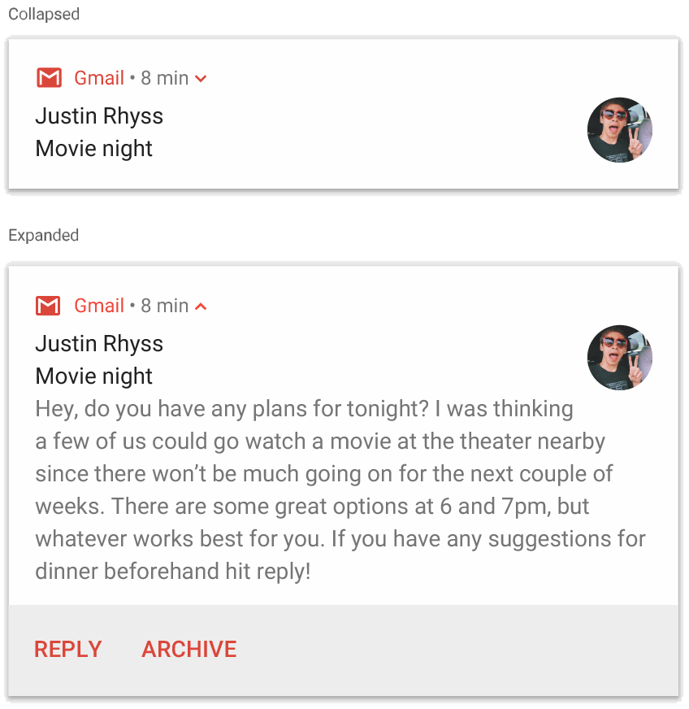
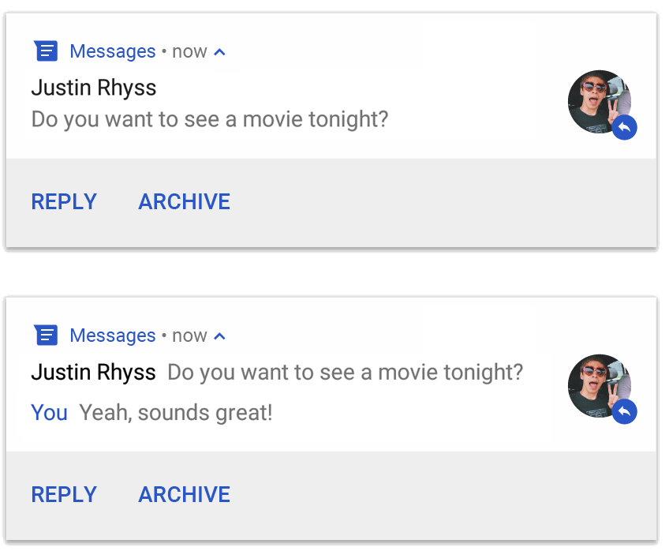
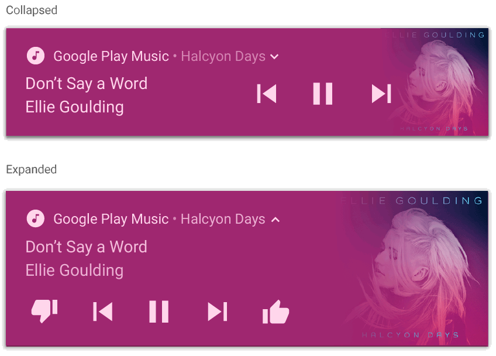

# NOTIFICATIONS
Almost with each release of Android, the notification APIs change. So, we have to use [`NotificationCompat`](https://developer.android.com/reference/androidx/core/app/NotificationCompat) and its subclasses, as well as [`NotificationManagerCompat`](https://developer.android.com/reference/androidx/core/app/NotificationManagerCompat) in our app. This will help us avoid writing conditional code to check API levels. `NotificationCompat` is updated as the platform evolves to include the latest methods.

## Create a notification channel

```kotlin
const val CHANNEL_ID = "CHANNEL_ID"

fun createNotificationChannels() {
    // Notifications channels are supported starting from android 8, API 26
    if (Build.VERSION.SDK_INT < Build.VERSION_CODES.O) {
        return
    }
    
    // Create a notification channel
    val channel = NotificationChannel(CHANNEL_ID,"Channel name",NotificationManager.IMPORTANCE_HIGH)
    channel.description = "This is an epic Channel!"

    // Enable the notification channel
    NotificationManagerCompat.from(this).apply {
        createNotificationChannel(channel)
    }
}
```

## Delete a notification channel

```kotlin
const val CHANNEL_ID = "CHANNEL_ID"

fun deleteNotificationChannel() {
    val notificationManager = NotificationManagerCompat.from(this)
    notificationManager.deleteNotificationChannel(CHANNEL_ID)
}
```


## Show a notification

```kotlin
// Show a notification
fun sendNotification() {
    val title = "Notification title"
    val message = "Notification message"
    val notification: Notification = NotificationCompat.Builder(this, CHANNEL_ID)
        .setSmallIcon(R.drawable.btn_star)
        .setContentTitle(title)
        .setContentText(message)
        
        // Set the notification's color
        .setColor(Color.BLUE)
        
        // Set the color specified in setColor as the notification's background color
        .setColorize(true)
        
        // Make this notification automatically dismissed when tapped
        .setAutoCancel(true)
        
        // Set this flag if we would only like the sound, vibration and ticker to be played if the notification is not already showing
        .setOnlyAlertOnce(true)
        
        // Set the intrusion level of the notification for Android 7.1 and lower. Use channel importance for Android 8 and higher.
        .setPriority(NotificationCompat.PRIORITY_HIGH)
        .setCategory(NotificationCompat.CATEGORY_MESSAGE)
        .build()
    notificationManager?.notify(NOTIFICATION_ID, notification)
}
```

## Show a notification that opens an activity when tapped
```kotlin
// Show a notification that opens an activity when tapped
fun sendNotification() {
    // Create an activity intent
    val activityIntent = Intent(this, MainActivity::class.java).apply {
        flags = Intent.FLAG_ACTIVITY_NEW_TASK or Intent.FLAG_ACTIVITY_CLEAR_TASK
    }
    // Wrap it in a pending intent
    val contentIntent = PendingIntent.getActivity(this, 0, activityIntent, 0)
    
    // Create a notification and submit it
    val notification: Notification = NotificationCompat.Builder(this, CHANNEL_ID)
        ..
        .setContentIntent(contentIntent)
        ..
        .build()
    notificationManager?.notify(NOTIFICATION_ID, notification)
}
```
## Show a notification with actions
```kotlin
// Show a notification with an action button that invokes a broadcast receiver
fun sendNotification() {
    // Create an intent for our broadcast receiver
    val broadcastIntent = Intent(this, NotificationReceiver::class.java)
    // Pass data to the broadcast receiver
    broadcastIntent.putExtra(ARG_NAME, message)
   
    // Wrap it in a pending intent
    // FLAG_UPDATE_CURRENT is used to the data in the extra argument if needed
    val actionIntent = PendingIntent.getBroadcast(
        context, 
        0, 
        broadcastIntent, 
        PendingIntent.FLAG_UPDATE_CURRENT
    )
    
    // Create a notification and submit it
    val notification: Notification = NotificationCompat.Builder(this, CHANNEL_ID)
        ..
        .addAction(R.mipmap.ic_launcher, "Toast", actionIntent))
        ..
        .build()
    notificationManager?.notify(NOTIFICATION_ID, notification)
}
```
**Notification receiver**
```kotlin
// 
class NotificationReceiver : BroadcastReceiver() {
    override fun onReceive(context: Context, intent: Intent) {
        val message = intent.getStringExtra(ARG_NAME)
        Toast.makeText(context, message, Toast.LENGTH_SHORT).show()
    }
}
```
**AndroidManifest.xml**
```xml
<receiver android:name="./art/notifications/NotificationReceiver" />
```

## Notification styles

### Show a notification with BigPictureStyle


```kotlin
// Show a notification with BigPictureStyle
fun sendNotification() {
    // Get bitmap from drawable 
    val largeIcon = BitmapFactory.decodeResource(resources, R.drawable.icon_x)    
   
   // Set up style
   val notificationStyle = NotificationCompat.BigPictureStyle()
        .bigPicture(largeIcon)
        // To make the image appear as a thumbnail only when the notification is collapsed
        .bigLargeIcon(null)
                
    // Create a notification and submit it
    val notification: Notification = NotificationCompat.Builder(this, CHANNEL_ID)
        ..
        // To make the image appear as a thumbnail only when the notification is collapsed
        .setLargeIcon(largeIcon)
        .setStyle(notificationStyle)
        ..
        .build()
    notificationManager?.notify(NOTIFICATION_ID, notification)
}
```

### Show a notification with BigTextStyle


```kotlin
// Show a notification with BigTextStyle
fun sendNotification() {
    // Get bitmap from drawable 
    val largeIcon = BitmapFactory.decodeResource(resources, R.drawable.icon_x)    
   
   // Set up style
   val notificationStyle = NotificationCompat.BigTextStyle()
        .bigText("Big text")
        // To show a different title when the notification is expanded
        .setBigContentTitle("Big Content Title")
        .setSummaryText("Summary Text")
                
    // Create a notification and submit it
    val notification: Notification = NotificationCompat.Builder(this, CHANNEL_ID)
        ..
        .setLargeIcon(largeIcon)
        .setStyle(notificationStyle)
        ..
        .build()
    notificationManager?.notify(NOTIFICATION_ID, notification)
}
```

### Show a notification with InboxStyle

```kotlin
// Show a notification with InboxStyle
fun sendNotification() {
    // Get bitmap from drawable 
    val largeIcon = BitmapFactory.decodeResource(resources, R.drawable.icon_x)    

   // Set up style
   val notificationStyle = NotificationCompat.InboxStyle()
        .addLine("This is line 1")
        .addLine("This is line 2")
        .addLine("This is line 3")
        .addLine("This is line 4")

    // Create a notification and submit it
    val notification: Notification = NotificationCompat.Builder(this, CHANNEL_ID)
        ..
        .setLargeIcon(largeIcon)
        .setStyle(notificationStyle)
        ..
        .build()
    notificationManager?.notify(NOTIFICATION_ID, notification)
}
```

### Show a notification with MessagingStyle


```kotlin
// Show a notification with MessagingStyle
fun sendNotification() {
   // Set up messages
    var message1 = NotificationCompat.MessagingStyle.Message(
        text: CharSequence,
        time: long,
        sender: CharSequence,
    )
    var message2 = NotificationCompat.MessagingStyle.Message(
        text: CharSequence,
        time: long,
        sender: CharSequence,
    )

   // Set up style
   val notificationStyle = NotificationCompat.MessagingStyle("Me")
        .setConversationTitle("Group Chat")
        .addMessage(message1)
        .addMessage(message2)

    // Create a notification and submit it
    val notification: Notification = NotificationCompat.Builder(this, CHANNEL_ID)
        ..
        .setStyle(notificationStyle)
        ..
        .build()
    notificationManager?.notify(NOTIFICATION_ID, notification)
}
```

### Show a notification with MediaStyle


```kotlin
// Show a notification with MediaStyle
fun sendNotification() {
    // Get bitmap from drawable 
    val artwork = BitmapFactory.decodeResource(resources, R.drawable.album_art)    

   // Set up style
   val mediaSession = MediaSessionCompat(context, "tag")
   val notificationStyle = MediaNotificationCompat.MediaStyle()
        .setShowActionsInCompactView(1 /* #1: pause button \*/)
        // Setting a media session will color the notification with colors from the artwork image 
        .setMediaSession(mediaSession.getSessionToken())

    // Create a notification and submit it
    val notification: Notification = NotificationCompat.Builder(this, CHANNEL_ID)
        ..
         // Add media control buttons that invoke intents in your media service
         // Max 5 actions are supported 
        .addAction(R.drawable.ic_prev, "Previous", prevPendingIntent) // #0
        .addAction(R.drawable.ic_pause, "Pause", pausePendingIntent) // #1
        .addAction(R.drawable.ic_next, "Next", nextPendingIntent) // #2
        // Set album art bitmap 
        .setLargeIcon(artwork)
        .setStyle(notificationStyle)
        .setSubText("Sub Text")
        ..
        .build()
    notificationManager?.notify(NOTIFICATION_ID, notification)
}
```

### Show a MessagingStyle notification with a direct reply action


```kotlin
// Show a MessagingStyle notification with a direct reply action
fun sendNotification() {
    // Set up direct reply input
    val remoteInput = RemoteInput.Builder("key_text_reply").run {
        setLabel("Your answer...")
        build()
    }
    
    // Create a PendingIntent for the reply action to trigger.
    val replyIntent = Intent(context, DirectReplyReceiver.class)
    
    // Wrap it in a pending intent
    val replyPendingIntent = PendingIntent.getBroadcast(
        context,
        0,
        replyIntent,
        PendingIntent.FLAG_UPDATE_CURRENT
    )
    
    // Create the reply action
    val action = NotificationCompat.Action.Builder(R.drawable.ic_reply_icon, "Reply", replyPendingIntent)
        .addRemoteInput(remoteInput)
        .build()

    // Set up messages
    val message1 = NotificationCompat.MessagingStyle.Message(
        text: CharSequence,
        time: long,
        sender: CharSequence,
    )
    val message2 = NotificationCompat.MessagingStyle.Message(
        text: CharSequence,
        time: long,
        sender: CharSequence,
    )

   // Set up style
   val notificationStyle = NotificationCompat.MessagingStyle("Me")
        .setConversationTitle("Group Chat")
        .addMessage(message1)
        .addMessage(message2)

    // Create a notification and submit it
    val notification: Notification = NotificationCompat.Builder(this, CHANNEL_ID)
        ..
        // Change input color
        .setColor(Color.BLUE)
        .setStyle(notificationStyle)
        .addAction(action)
        ..
        .build()
    notificationManager?.notify(NOTIFICATION_ID, notification)
}
```
**Direct reply receiver**
```kotlin
// 
class DirectReplyReceiver : BroadcastReceiver() {
    override fun onReceive(context: Context, intent: Intent) {
        val remoteInput = RemoteInput.getResultsFromIntent(intent)
        remoteInput?.let {
            val reply = getCharSequence("key_text_reply")
            Toast.makeText(context, reply, Toast.LENGTH_SHORT).show()
            // Resend notification to show the reply and stop the input's loading state
        }
    }
}
```
**AndroidManifest.xml**
```xml
<receiver android:name=".DirectReplyReceiver" />
```

### Show a notification with an undetermined progress bar


```kotlin
// Show a notification with an undetermined progress bar
fun sendNotification() {
    // Set up notification
    val builder = NotificationCompat.Builder(this, CHANNEL_ID).apply {
        setContentTitle("Installing application")
        setContentText("Installation in progress")
        setSmallIcon(R.drawable.ic_notification)
        setPriority(NotificationCompat.PRIORITY_LOW
        // Disable cancelling for the notification
        setOngoing(true)
        // To make the sound/vibration/light alert happen only the first time
        setOnlyAlertOnce(true)
    }
    
    NotificationManagerCompat.from(this).apply {
        // Submit the initial notification with an undetermined progress mode
        builder.setProgress(0, 0, true)
        notify(NOTIFICATION_ID, builder.build())

        // Simulate installing an application in background 
        Thread {
            // Simulate installation waiting time
            SystemClock.sleep(6000)    
            
            // When done, update the notification one more time to remove the progress bar
            builder.setContentText("Installation finished")
                // Set to finished state
                .setProgress(0, 0, false)
                // Make notification cancellable
                .setOngoing(false)
            notify(NOTIFICATION_ID, notification.build())
        }.start()
    }
}
```

### Show a notification with a determined progress bar


```kotlin
// Show a notification with a determined progress bar
fun sendNotification() {
    // Set up notification
    val builder = NotificationCompat.Builder(this, CHANNEL_ID).apply {
        setContentTitle("Picture Download")
        setContentText("Download in progress")
        setSmallIcon(R.drawable.ic_notification)
        setPriority(NotificationCompat.PRIORITY_LOW
        // Disable cancelling for the notification
        setOngoing(true)
        // To make the sound/vibration/light alert happen only the first time
        setOnlyAlertOnce(true)
    }
    
    val PROGRESS_MAX = 100
    var progress = 0
    NotificationManagerCompat.from(this).apply {
        // Submit the initial notification with zero progress in determined progress mode
        builder.setProgress(PROGRESS_MAX, PROGRESS_CURRENT, false)
        notify(NOTIFICATION_ID, builder.build())

        // Simulate downloading a picture in background 
        Thread {
            SystemClock.sleep(2000)    
            
            // Simulate downloading progress 
            while (progress <= progressMax) {
                builder.setProgress(PROGRESS_MAX, progress, false)
                notify(NOTIFICATION_ID, notification.build())
                SystemClock.sleep(1000)
                progress += 10
            }
            
            // When done, update the notification one more time to remove the progress bar
            builder.setContentText("Download finished")
                // Set to finished state
                .setProgress(0, 0, false)
                // Make notification cancellable
                .setOngoing(false)
            notify(NOTIFICATION_ID, notification.build())
        }.start()
    }
}
```

## Create a fullscreen notification

```kotlin
const val CHANNEL_ID = "CHANNEL_ID"
const val NOTIFICATION_ID = "NOTIFICATION_ID"

fun sendFullscreenNotification() {
    val fullScreenIntent = Intent(this, CallActivity::class.java)
    val fullScreenPendingIntent = PendingIntent.getActivity(this, 0, fullScreenIntent, PendingIntent.FLAG_UPDATE_CURRENT)

    val incomingCallNotification = NotificationCompat.Builder(this, CHANNEL_ID)
        .setSmallIcon(R.drawable.notification_icon)
        .setContentTitle("Incoming call")
        .setContentText("(919) 555-1234")
        .setPriority(NotificationCompat.PRIORITY_HIGH)
        .setCategory(NotificationCompat.CATEGORY_CALL)

        // Use a full-screen intent only for the highest-priority alerts where you
        // have an associated activity that you would like to launch after the user
        // interacts with the notification. Also, if your app targets Android 10
        // or higher, you need to request the USE_FULL_SCREEN_INTENT permission in
        // order for the platform to invoke this notification.
        .setFullScreenIntent(fullScreenPendingIntent, true)
        .build()

    NotificationManagerCompat.from(this).apply {
        notify(NOTIFICATION_ID, incomingCallNotification)
    }
}
```

## Create a notification group


```kotlin
// Show notifications within a group
fun sendNotification() {
    // Create a notification belonging to a group
    val notification1: Notification = NotificationCompat.Builder(this, CHANNEL_ID)
        ..
        .setGroup(GROUP_ID)
        .build()
        
    // Create another notification belonging to the same group
    val notification2: Notification = NotificationCompat.Builder(this, CHANNEL_ID)
        ..
        .setGroup(GROUP_ID)
        .build()

    // Create a summary notification for the notification group
    val summaryNotification: Notification = NotificationCompat.Builder(this, CHANNEL_ID)
        ..
        // Set content text to support devices running API level < 24
        .setContentText("2 new messages")
        // Build summary info into InboxStyle template to support devices running API level < 24
        .setStyle(NotificationCompat.InboxStyle()
                .addLine("Alex Faarborg Check this out")
                .addLine("Jeff Chang Launch Party")
                .setBigContentTitle("2 new messages")
                .setSummaryText("janedoe@example.com"))
        .setGroup(GROUP_ID)
        // Set noise behavior. If GROUP_ALERT_SUMMARY is needed, make sure to set it on the child notifications
        .setGroupAlertBehavior(NotificationCompat.GROUP_ALERT_CHILDREN)
        .setGroupSummary(true)
        .build()

    NotificationManagerCompat.from(this).apply {
        notify(NOTIFICATION1_ID, notification1)
        notify(NOTIFICATION2_ID, notification2)
        notify(NOTIFICATION_SUMMARY_ID, summaryNotification)
    }
}
```

## Create a notification channel groups


```kotlin
const val CHANNEL_ID = "CHANNEL_ID"

fun createNotificationChannels() {
    // Notifications channels are supported starting from android 8, API 26
    if (Build.VERSION.SDK_INT < Build.VERSION_CODES.O) {
        return
    }
    
    // Create a notification channel group
    val channelGroup = NotificationChannelGroup(
        GROUP_ID,
        "Group name"
    )

    // Create a notification channel
    val channel = NotificationChannel(CHANNEL_ID,"Channel name",NotificationManager.IMPORTANCE_HIGH).apply {
        description = "This is an epic Channel!"
        setGroup(GROUP_ID)
    }

    // Enable the notification channel
    NotificationManagerCompat.from(this).apply {
        createNotificationChannelGroup(channelGroup)
        createNotificationChannel(channel)
    }
}
```

## Check notification settings


```kotlin
const val CHANNEL_ID = "CHANNEL_ID"

var notificationManager: NotificationManager? = null

fun sendOnChannel() {
    notificationManager = NotificationManagerCompat.from(this)
    
    // Check if notifications are enabled
    if (!notificationManager.areNotificationsEnabled()) {
        openNotificationSettings()
        return
    }

    // Check if the channel is blocked or deleted
    if (Build.VERSION.SDK_INT >= Build.VERSION_CODES.O && isChannelBlocked(CHANNEL_1_ID)) {
        openChannelSettings(CHANNEL_1_ID)
        return
    }
    
    // If all settings are acceptable, send the notification
    sendNotification()
}

@RequiresApi(26)
fun isChannelBlocked() {
    val channel = notificationManager.getNotificationChannel(CHANNEL_ID)
    return channel != null && channel.getImportance() == NotificationManager.IMPORTANCE_NONE
}

@RequiresApi(26)
fun openChannelSettings() {
    val intent = Intent(Settings.ACTION_CHANNEL_NOTIFICATION_SETTINGS).apply {
        putExtra(Settings.EXTRA_APP_PACKAGE, getPackageName())
        putExtra(Settings.EXTRA_CHANNEL_ID, CHANNEL_ID)
    }
    startActivity(intent)
}
```

## Create a custom notification layout

```kotlin
const val CHANNEL_ID = "CHANNEL_ID"
const val NOTIFICATION_ID = "NOTIFICATION_ID"

fun sendNotification() {
    // Get the layouts to use in the custom notification
    val notificationCollapsed = RemoteViews(packageName, R.layout.notification_collapsed)
    val notificationExpanded = RemoteViews(packageName, R.layout.notification_expanded)

    // Update views
    collapsedView.setTextViewText(viewId, "Hello World!")
    collapsedView.setBoolean(viewId, "setChecked", true)

    // Set up a click listener
    val clickIntent = Intent(this, NotificationReceiver.class)
    val clickPendingIntent = PendingIntent.getBroadcast(this, 0, clickIntent, 0)

    // Register the click listener
    expandedView.setOnClickPendingIntent(viewId, clickPendingIntent)

    // Apply the layouts to the notification
    val customNotification = NotificationCompat.Builder(context, CHANNEL_ID)
            .setSmallIcon(R.drawable.notification_icon)
            
            // To use if we want the system to decorate with the usual notification icon, title, timestamp, and expansion arrow 
            .setStyle(NotificationCompat.DecoratedCustomViewStyle())
            .setCustomContentView(notificationLayout)
            .setCustomBigContentView(notificationLayoutExpanded)
            .build()

    NotificationManagerCompat.from(this).apply {
        notify(NOTIFICATION_ID, customNotification)
    }
}
```
